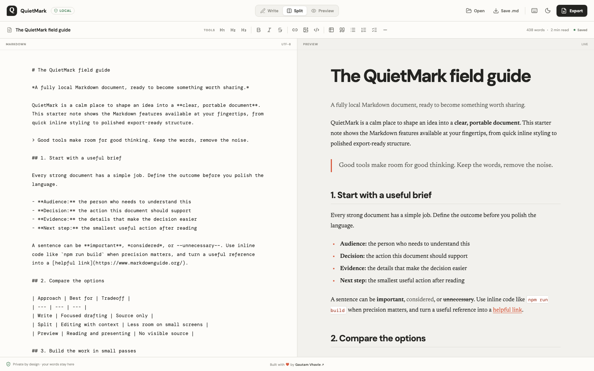

<p align="center">
  
</p>

<h1 align="center">QuietMarkdown</h1>

<p align="center">
  A private, local-first Markdown editor for writing quickly and exporting beautifully.
</p>

<p align="center">
  <a href="https://quietmarkdown.vercel.app/"><strong>Open QuietMarkdown</strong></a>
  &nbsp;·&nbsp;
  <a href="#features">Features</a>
  &nbsp;·&nbsp;
  <a href="#quick-start">Quick start</a>
  &nbsp;·&nbsp;
  <a href="#deployment">Deploy</a>
</p>

<p align="center">
  <a href="https://github.com/GautamVhavle/QuietMarkdown/actions"></a>
  <a href="https://github.com/GautamVhavle/QuietMarkdown/releases"></a>
  <a href="https://quietmarkdown.vercel.app/"></a>
  <a href="LICENSE"></a>
  
  
</p>

<p align="center">
  
</p>

---

## Why QuietMarkdown?

Markdown writing tools tend to choose between two extremes: bare browser utilities with fragile exports, or feature-heavy workspaces that make a blank page feel like a setup task. QuietMarkdown stays deliberately small on the surface and capable underneath.

- **Private by design.** No account, backend, database, analytics, or document upload. Your words never leave your device.
- **A library, not a lone note.** Keep many documents in one calm workspace.
- **Fast where it matters.** Live split preview, real-time Mermaid diagrams, and instant find & replace.
- **Files you own.** Open, drag & drop, paste images into, and download normal `.md` files. Markdown is the canonical source of truth.
- **Export with confidence.** Styled standalone HTML, multipage PDF, and true 2× PNG pages — what the page preview shows is what you get.

## Features

### A calm writing workspace

- Write, Split, and Preview modes that adapt from desktop to mobile
- Multi-document library — create (`⌘/Ctrl+Alt+N`), switch, duplicate, and delete notes in one place
- Find & Replace with match counts, wrap-around navigation, and match-case toggle (`⌘/Ctrl+F`, `⌘/Ctrl+H`)
- Paste or drop screenshots straight into the text as embedded data URLs — downscaled and optimized locally
- Local autosave with an honest save state (including "Not saved" if browser storage refuses writes)
- Light and dark themes, word count, reading time, accessible controls, reduced-motion support

### Useful Markdown, not feature bloat

- Headings, bold, italic, strikethrough, links, lists, blockquotes, dividers, tables, task lists, inline code, and fenced code blocks
- Syntax highlighting for Bash, CSS, HTML, JavaScript, JSON, Markdown, Python, and TypeScript
- Safe rendered output through DOMPurify sanitization
- A built-in field guide that demonstrates every supported feature on first launch

### Mermaid diagrams in real time

Type a ` ```mermaid ` fence and watch it render live, character by character:

- Instant re-rendering while you edit, with LRU caching so untouched diagrams never redraw
- Graceful failure: invalid syntax keeps the last valid frame visible with a small warning chip, then recovers automatically when the syntax is fixed
- Theme-aware restyling — diagrams follow light/dark mode
- Diagrams are first-class citizens in exports (see below)

### A watermark-first export studio

| Export | What you get |
| --- | --- |
| **PDF** | A direct multipage PDF download that matches the page preview, with element-aware pagination that keeps diagrams, tables, and code blocks intact across breaks |
| **HTML** | A portable standalone document with selected styling and no watermark |
| **PNG pages** | True 2× page images. Multi-page documents download as one ZIP containing numbered PNG files |

Choose from eight structurally distinct document systems:

**Editorial** · warm expressive essays — **Minimal** · quiet working documents — **Academic** · numbered sections, booktabs tables — **Manuscript** · typewriter drafts — **Swiss** · graphic modernist hierarchy — **Letterpress** · classic crafted documents — **Executive** · sharp professional reports — **Notebook** · approachable personal notes

Watermarks are part of the PDF and PNG experience, not an afterthought. Control text, placement, tile mode, opacity, size, rotation, and color while previewing the final result. HTML and Markdown downloads remain clean.

### Works offline

A service worker caches the application shell after your first visit, so QuietMarkdown opens and keeps working without a network connection. Drafts live in browser storage either way.

## Quick start

### Prerequisites

- Node.js 20 or newer
- npm 10 or newer

### Run locally

```bash
git clone https://github.com/GautamVhavle/QuietMarkdown.git
cd QuietMarkdown
npm install
npm run dev
```

Open the local URL printed by Vite.

### Quality checks

| Command | Purpose |
| --- | --- |
| `npm run dev` | Start the Vite development server |
| `npm run lint` | Lint TypeScript and React source |
| `npm run build` | Create a static production bundle in `dist` |
| `npm run test:e2e` | Run desktop, tablet, and mobile Playwright workflows |
| `npm run preview` | Serve the production bundle locally |
| `npm run assets:generate` | Rebuild the branded app icon and social image assets |

## Keyboard shortcuts

| Action | macOS | Windows / Linux |
| --- | --- | --- |
| Bold / Italic | `⌘B` / `⌘I` | `Ctrl+B` / `Ctrl+I` |
| Link / Inline code | `⌘K` / `⌘E` | `Ctrl+K` / `Ctrl+E` |
| Undo / Redo | `⌘Z` / `⌘⇧Z` | `Ctrl+Z` / `Ctrl+Y` |
| Find / Find & Replace | `⌘F` / `⌘H` | `Ctrl+F` / `Ctrl+H` |
| New document | `⌘⌥N` | `Ctrl+Alt+N` |
| Open file | `⌘O` | `Ctrl+O` |
| Download Markdown | `⌘⇧S` | `Ctrl+Shift+S` |
| Export studio | `⌘⇧E` | `Ctrl+Shift+E` |
| Shortcut cheat sheet | `⌘⇧/` | `Ctrl+Shift+/` |

## Architecture

```text
src/
├── App.tsx                  # Editor shell, document library, Export Studio
├── components/
│   └── ErrorBoundary.tsx    # Crash guard keeping drafts recoverable
├── lib/
│   ├── markdown.ts          # Sanitized rendering + real-time Mermaid engine
    ├── export.ts            # Portable HTML, styling presets, downloads
    ├── pagination.ts        # Element-aware page-break computation
    └── storage.ts           # Quota-safe localStorage wrapper
├── styles.css               # Design tokens, responsive UI, export presets
└── types.ts                 # Shared editor/export types

public/
├── sw.js                    # Offline service worker
├── site.webmanifest         # PWA manifest
└── ...                      # Favicons, icons, social image, sample image

scripts/                     # Reproducible brand-asset generator
tests/                       # Playwright desktop/tablet/mobile workflows
```

### Technology choices

- **React + TypeScript + Vite** for a fast static client application
- **markdown-it** and **markdown-it-task-lists** for focused GFM rendering
- **Mermaid v11** loaded lazily so diagram code never slows first paint
- **DOMPurify** to sanitize rendered Markdown and every export
- **Highlight.js** with a deliberately small language set
- **html-to-image**, **pdf-lib**, and **JSZip** for high-fidelity page-based exports
- **Playwright** for responsive end-to-end coverage

### How exports stay pixel-honest

The export pipeline renders each page exactly as the preview does: Markdown → sanitized HTML → Mermaid rasterization at 3× scale → element-aware pagination → per-page capture. Diagrams are converted to images before capture so nothing shifts between preview and print, and oversized diagrams are auto-fit to one page's content area instead of being sliced across two.

## Privacy

QuietMarkdown runs entirely in the browser. Markdown is the source of truth; drafts, preferences, and embedded images are stored locally in browser storage. There are no accounts, no uploads, no analytics, and no telemetry of any kind.

A few practical notes:

- Clearing site data removes autosaved drafts — download the `.md` file when you need a durable backup.
- Remote image URLs can contact their host and can be blocked by browser CORS rules during PNG export. Prefer pasting images directly (they become local data URLs) for dependable private exports.
- PDF and PNG pages render locally at fixed page dimensions; very large image-heavy documents can require additional browser memory during generation.

## Roadmap

QuietMarkdown follows one rule: everything must keep working offline and privately. Candidate directions, roughly in order:

1. Document folders & tagging within local storage
2. Optional end-to-end encrypted sync (user-supplied storage, opt-in only)
3. Footnote and math syntax support
4. Version snapshots beyond undo history
5. Team-oriented export branding (custom fonts, logos)

Feature requests are welcome via [issues](https://github.com/GautamVhavle/QuietMarkdown/issues) — especially ones that fit the local-first philosophy.

## FAQ

**Where are my documents stored?**
In your browser's `localStorage` on this device only. Nothing is transmitted anywhere.

**What happens if I clear my browser data?**
Autosaved drafts go with it. Use *Save .md* (`⌘/Ctrl+Shift+S`) for anything you cannot afford to lose.

**Can I use it on my phone?**
Yes. The layout adapts to portrait screens with focused Write and Preview modes, and the app installs as a PWA.

**Do embedded images bloat storage?**
They are downscaled to at most 1600px and compressed before insertion, and the save system warns you honestly if storage refuses further writes.

## Deployment

QuietMarkdown deploys as a static application on Vercel. `vercel.json` configures the Vite build, output directory, security headers (CSP, frame protection, content-type sniffing), clean URLs, and immutable caching for compiled assets.

```bash
npm run build
npx vercel --prod
```

If you connect a custom domain, set `VITE_SITE_URL` to its origin so QuietMarkdown can generate canonical and Open Graph URLs correctly. See `.env.example`.

## Contributing

Small, thoughtful improvements are welcome. Please read [CONTRIBUTING.md](CONTRIBUTING.md), keep the app local-first, avoid introducing document uploads or accounts, and run all checks before opening a pull request.

Security issues: please follow [SECURITY.md](SECURITY.md) rather than filing a public issue.

## License

QuietMarkdown is released under the [MIT License](LICENSE).

## Credits

Designed and built with care by [Gautam Vhavle](https://gautamvhavle.xyz/).
